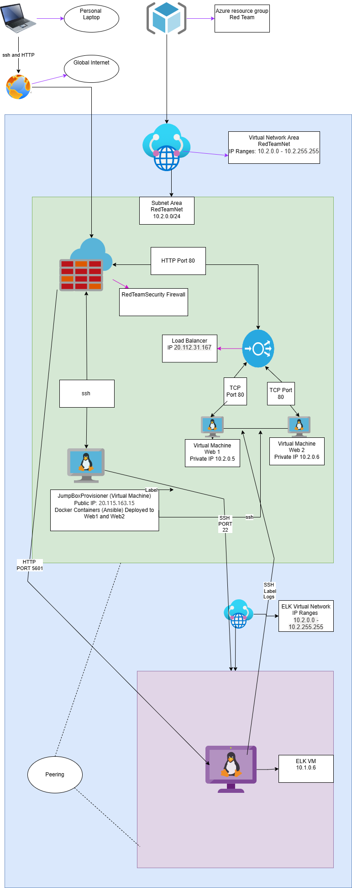

# ELK-STACK-Project
Azure VM setup with NSG and webservers. VMs configured with ELK to retrieve data from log files on webservers.
## Automated ELK Stack Deployment

The files in this repository were used to configure the network depicted below.

These files have been tested and used to generate a live ELK deployment on Azure. They can be used to either recreate the entire deployment pictured above. Alternatively, select portions of the ansible file may be used to install only certain pieces of it, such as Filebeat.

  -[Filebeat Playbook](Ansible/filebeat-playbook.txt)
  

This document contains the following details:
- Description of the Topologu
- Access Policies
- ELK Configuration
  - Beats in Use
  - Machines Being Monitored
- How to Use the Ansible Build

### Description of the Topology

The main purpose of this network is to expose a load-balanced and monitored instance of DVWA, the D*mn Vulnerable Web Application.

Load balancing ensures that the application will be highly efficient, in addition to restricting traffic to the network.
- DoS attacks are a prevalent issue experienced by websites.  To mitgate the issue load balancer are utilized to distribute web traffic  between webservers.  The Jump box has the advantage of being exposed to the internet traffic acting a router, but allows access to the  VMs through SSH.

Integrating an ELK server allows users to easily monitor the vulnerable VMs for changes to the file systems and system resources.
-Filebeat is used to monitor changes in application log files. 
-Metricbeat is used to monitor system conditions of the CPU, RAM, Network usage.  

The configuration details of each machine may be found below.
_Note: Use the [Markdown Table Generator](http://www.tablesgenerator.com/markdown_tables) to add/remove values from the table_.

| Name       | Function   | IP Address    | Operating System |
|------------|------------|---------------|------------------|
| Jump Box   | Gateway    | 10.2.0.4      | Linux            |
| Web 1      | Webserver  | 10.2.0.5      | Linux            |
| Web 2      | Webserver  | 10.2.0.6      | Linux            |
| ELK        |Kibana VM   | 10.1.0.6      | Linux            |
|LoadBalancer|LoadBalancer| 20.112.31.167 |

### Access Policies

The following machines on the internal network are exposed to the public Internet.  
Inbound rules has been created in the Azure NSG to allow communication through the allowed ports. 

-Jump Box Port 22 
-Load Balancer Port 80
-ELK Port 5601

Only the Jump Box machine can accept connections from the Internet. Access to this machine is only allowed from the following IP addresses:
-Personal Home IP (reference in the document as PHIP)-will be protected for privacy purposes.

Machines within the network can only be accessed by SSH.
-From my PHIP was the ablity to SSH into the Jump Box.  The Jump Box held the ansible container which was used to SSH into ELK, Web 1 and Web 2 servers.  The ELK accesed through PHIP to display Kibana traffic only and only can other VM and ansible containers through SSH. 

A summary of the access policies in place can be found in the table below.

| Name     | Publicly Accessible | Allowed IP Addresses |
|----------|---------------------|----------------------|
| Jump Box | Yes                 |       PHIP           |
| Web 1    | No                  |     10. 2.0.4        |
| Web 2    | No                  |     10. 2.0.4        |
| ELK-VM   | No                  |     10. 2.0.4        |

### Elk Configuration

Ansible was used to automate configuration of the ELK machine. No configuration was performed manually, which is advantageous because...
- Ansible automatic configurations, is allabout effiency.  In the event of mass updates or the increase in the installaton of webservers the setup is simplified.

The playbook implements the following tasks:
- Download and install Docker.io 
- install python-pip3
- Increase VM memory 
- Download and launch the ELK container
- Enable docker and ELK to start at system boot

The following screenshot displays the result of running `docker ps` after successfully configuring the ELK instance.

### Target Machines & Beats
This ELK server is configured to monitor the following machines:
- Web 1 10.2.0.5
- Web 2 10.2.0.6

We have installed the following Beats on these machines:
- Filebeat and Metricbeat 

These Beats allow us to collect the following information from each machine:
- Filbeat will collect data for webserver logs and highlight any changes that have been made.  Metric beat will highlight the usage  of webserver CPU, RAM,and Network.

### Using the Playbook
In order to use the playbook, you will need to have an Ansible control node already configured. Assuming you have such a control node provisioned: 

-Open a terminal to ssh into the Jumpbox.
-Then start the ansible container with command sudo docker start (name of ansible)
-For continous run of ansible use command 
sudo doccker exec -ti (name of ansible)
-Configure the filebeat.config file to include ELK VM private IP as host the location to play the ansible in Line 1106. In line 1806  do the same 
-The same lines shoul have ths same changes in the metricbeat.config file.

-Then in the terminal use the command line ansible-playbook (file name).yml.  These are yaml files for ansible. 

-Using the PHIP:5601 to log into Kibana to verify results.
